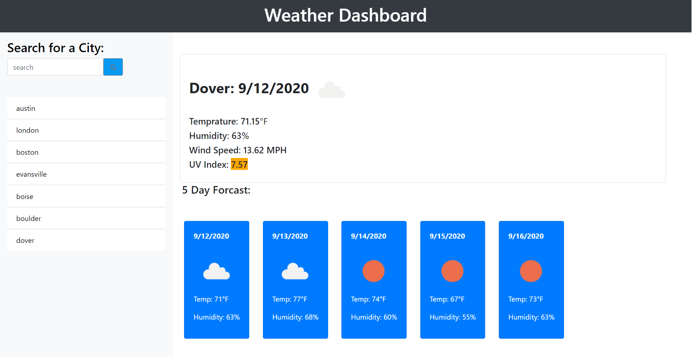

# Weather-Dashboard
In this application we used Third Party APIs to get the weather and current conditions for the location that the user searches for. We used JavaScript to make the application interactive by allowing ciities that are searched for to be saved into a card list that can be clicked on again to see that cities conditions at anytime.

## Languages and tools used
1. HTML5
2. CSS3
3. JavaScript
4. Bootstrap
5. Moment.js
6. AJAX

### Application can be deployed here:https://joshcarter8400.github.io/Weather-Dashboard/

